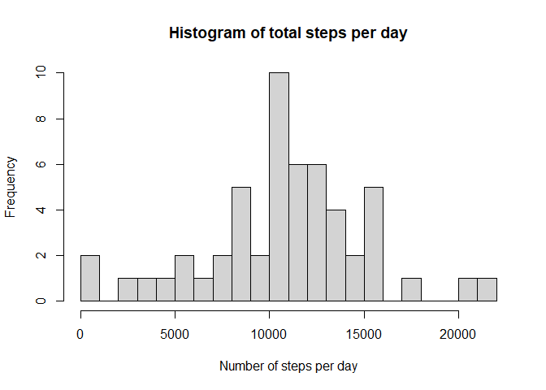
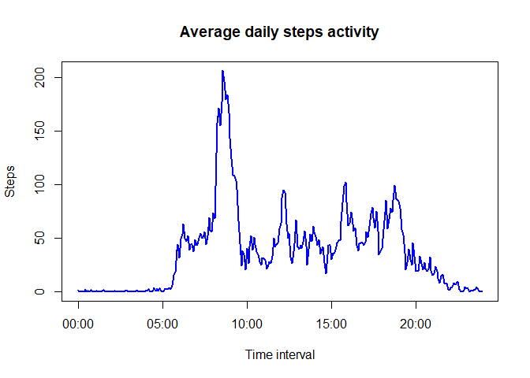
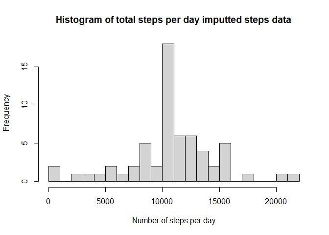
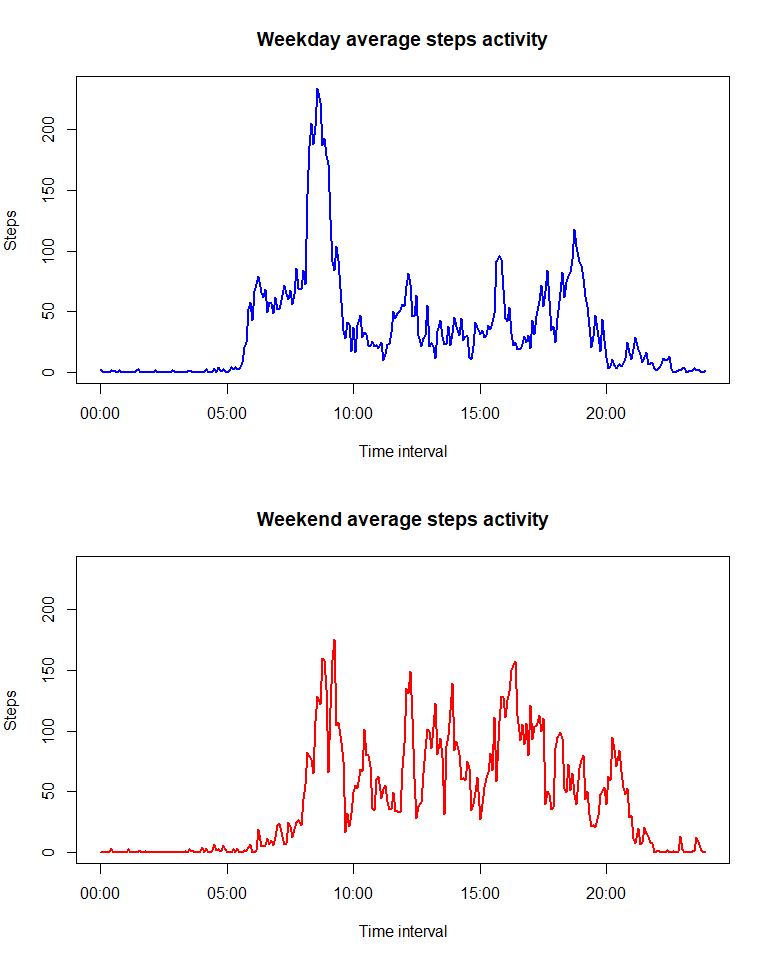

#### By: Ian Partridge
#### Date: 20/07/2022

#### Packages used in the assessment

```r
library(dplyr)
library(lattice)
```

## Introduction

This document is the required submission for the Coursera Reproducible Research
course Peer Assessment 1. Details of the requirement can be found 
[here](https://www.coursera.org/learn/reproducible-research/peer/gYyPt/course-project-1).
The project entails loading a dataset and then conducting exploratory data 
analysis upon it, as given in the following sections.

## Loading and preprocessing the data
The activity.zip file contained the dataset activity.csv, which was loaded into a 
dataframe. The string type date column was converted to the date data type. 
The steps column was read in a integer data type. The interval column was converted 
from a string to a datetime data type. The interval *date* portion of the 
datetime was a constant date for all the observations.


```r
#read in dataset
activity <- read.csv(unz('activity.zip','activity.csv'), header = T)
#column data type conversion
activity$date <- as.Date(activity$date, format="%Y-%m-%d")
activity$interval <- strptime(sprintf("%04d", activity$interval), format="%H%M")
#show head of datatset
head(activity)
```

```
##   steps       date            interval
## 1    NA 2012-10-01 2022-07-21 00:00:00
## 2    NA 2012-10-01 2022-07-21 00:05:00
## 3    NA 2012-10-01 2022-07-21 00:10:00
## 4    NA 2012-10-01 2022-07-21 00:15:00
## 5    NA 2012-10-01 2022-07-21 00:20:00
## 6    NA 2012-10-01 2022-07-21 00:25:00
```


## What is mean total number of steps taken per day?
At this stage missing values in the dataset where ignored. A histogram of the 
total number of steps taken each day was determined and is plotted below.

```r
sumdf <- activity %>%
  group_by(date) %>%
  summarise(sum = sum(steps))
hist(sumdf$sum, breaks=20,
     main="Histogram of total steps per day",
     xlab= "Number of steps per day")
```

<!-- -->

The histogram bin width is approx. 1000 steps.  
The mean and median total number of steps taken per day were 
10766.19 and 10765
respectively

## What is the average daily activity pattern?
A time series plot of the 5-minute interval (x-axis) and the average number of steps taken, averaged across all days (y-axis) was determined and plotted below.

```r
noDates <- length(unique(activity$date))
intdf <- activity %>%
  group_by(interval) %>%
  summarise(mean = mean(steps,na.rm = TRUE))
maxTime<- intdf$interval[which(intdf$mean == max(intdf$mean))]
plot(x=intdf$interval, 
     y=intdf$mean, 
     xlab="Time interval",
     ylab="Steps",
     lwd=2,
     col="blue",
     main="Average daily steps activity",
     type = "l")
```

<!-- -->

The 5-minute interval of 08:35 contained the
maximum average number of steps of 206.1698113

## Imputing missing values
There are a number of days/intervals where there are missing step values 
(NA in dataset). The presence of missing data may introduce bias into some calculations or summaries of the data. The following was done to elevate the issue.


```r
numberStepNA <- length(activity$steps[is.na(activity$steps)])
```

The total number of missing values in the dataset, i.e. the total number of rows with an NA was 2304.

To overcome this, assumptions were made to fill the missing data, as follows:

1. Copy dataset to new dataset
2. In new dataset if steps equals NA use associated interval mean as previously calculated as the steps for that interval

A histogram was created of the total number of steps taken each day and is given below.


```r
newActivity <- data.frame(activity)
#add a new column (meanSteps) in activity dataframe with associated 
#mean steps for interval
newActivity$meanSteps <- rep(intdf$mean,times=(length(activity$steps)/
                                              length(intdf$mean)))
#add a new comun (finalSteps) which = steps value if steps not NA else 
#use the meanSteps value
newActivity <- newActivity %>% mutate(steps = ifelse(is.na(steps),meanSteps, steps))
sumdfmean <- newActivity %>%
  group_by(date) %>%
  summarise(sum = sum(steps))
hist(sumdfmean$sum, breaks=20,
     main="Histogram of total steps per day imputted steps data",
     xlab= "Number of steps per day")
```

<!-- -->

The histogram bin width is approx. 1000 steps.  
The mean and median total number of steps taken per day were 
10766.19 and 
10766.19
respectively. The mean and median values are the same or very close to the 
values found when missing data was ignored, as such the effect of the missing
data is not signficant.


## Are there differences in activity patterns between weekdays and weekends?
The dataset was examined to study the effects of the day type, i.e. weekday or weekend. The following panel plot shows the difference in average number of steps taken averaged across all weekday days or weekend day

```r
newActivity <- activity %>% mutate(day = ifelse((weekdays(date)=="Saturday" | weekdays(date)=="Sunday"),"weekend","weekday"))
newActivity$day <- as.factor(newActivity$day)

weekdayDf <- newActivity %>%
  group_by(interval) %>%
  filter(day=="weekday") %>%
  summarise(mean = mean(steps,na.rm = TRUE))

weekendDf <- newActivity %>%
  group_by(interval) %>%
  filter(day=="weekend") %>%
  summarise(mean = mean(steps,na.rm = TRUE))
rag <- c(0,max(max(weekdayDf$mean),max(weekendDf$mean)))
par(mfrow=c(2,1), mar=c(5, 4, 4, 2))
plot(x=weekdayDf$interval, 
     y=weekdayDf$mean, 
     xlab="Time interval",
     ylab="Steps",
     lwd=2,
     col="blue",
     type = "l",
     ylim = rag,
     main="Weekday average steps activity")
plot(x=weekendDf$interval, 
     y=weekendDf$mean, 
     xlab="Time interval",
     ylab="Steps",
     lwd=2,
     col="red",
     ylim = rag,
     type = "l",
     main="Weekend average steps activity")
```

<!-- -->
